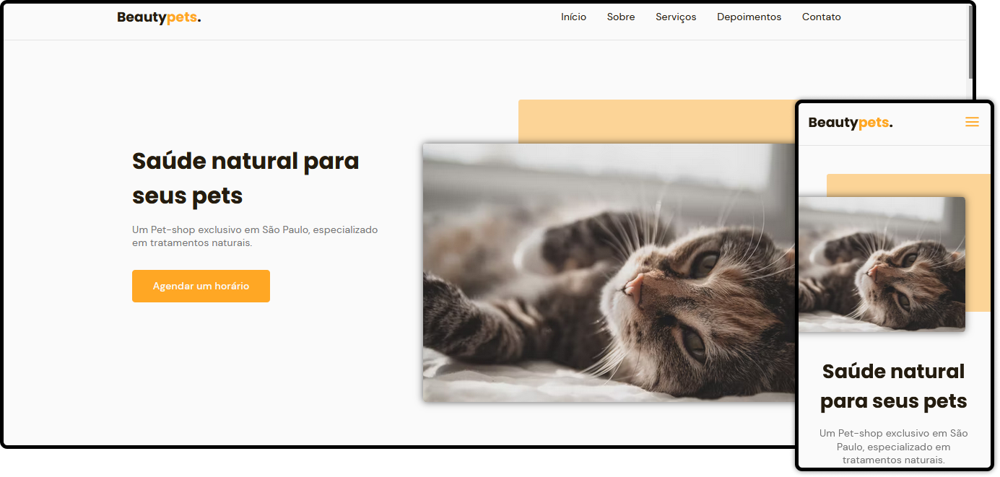

<h1 align="center">
    <strong>BeautyPets.</strong>
</h1>

 

  

## 🚀 Tecnologias

Esse projeto foi desenvolvido com as seguintes tecnologias:

- HTML5
- CSS3
- JavaScript
- Scrollreveal
- SwiperJS

## 💻 Projeto

Essa é uma landing page desenvolvida durante um evento da Roketseat chamado NLW (Next Level Week). Meu principal objetivo ao participar dessa trilha foi justamente para concretizar alguns conceitos. Optei por fazer algumas mudanças, sendo uma delas o tema abordado. 

## 🔖 Layout

Você pode visualizar o layout do projeto através <a href="https://www.figma.com/file/bycoYMxAu8QEdJkyTnWIpu/Origin-Six?node-id=0%3A1">desse link</a>. Lembrando que você precisa ter uma conta no Figma para acessá-lo.

 

---

## Licença

Esse projeto está sob a licença MIT. Veja o arquivo [LICENSE](LICENSE.md) para mais detalhes.
